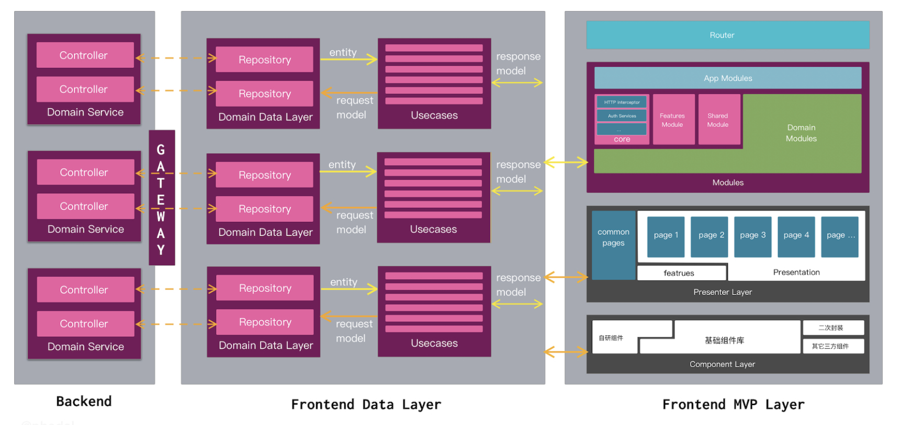
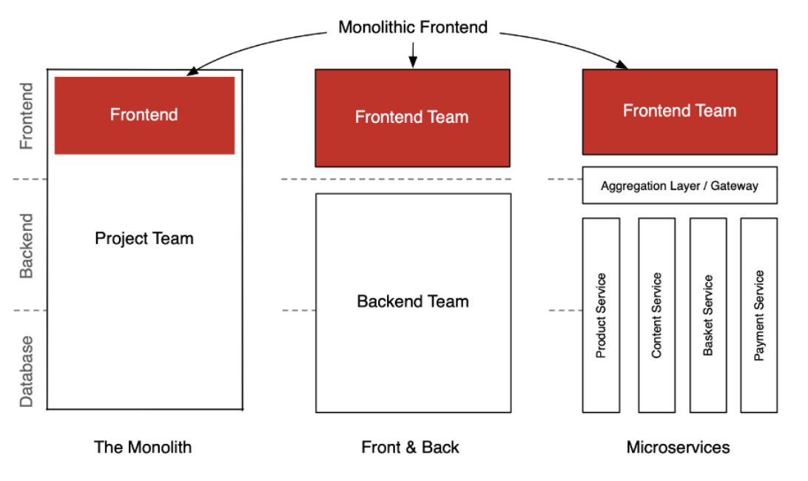
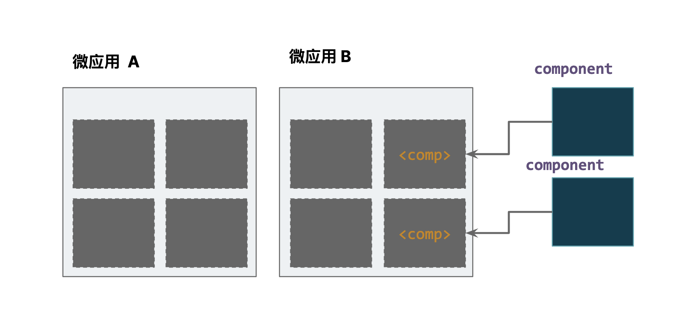
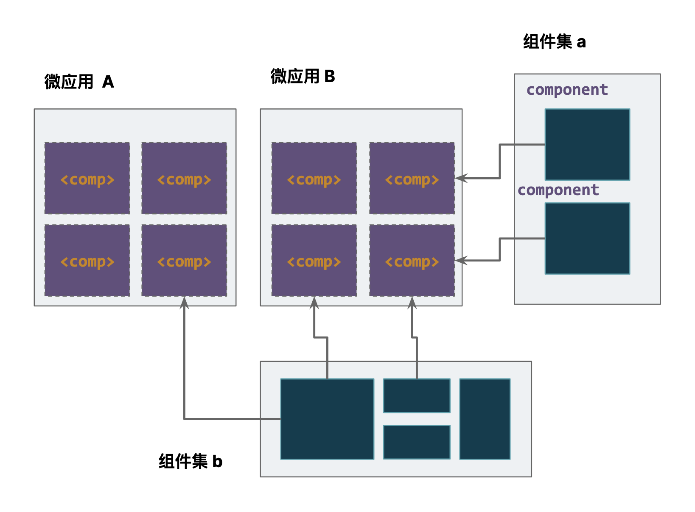

# Componentless Architecture：无组件架构

English version: [README_en.md](README_en.md)

> 无组件（Componentless）架构是一种架构模式，它是指大量依赖于**三方组件**（运行时依赖的组件而非编译时依赖的组件，即编译即服务）或暂存容器中运行的自定义代码的前端应用。应用的三方组件如同三方 API 服务一样，可各自独立发布、独立部署，应用无需重新编译、构建和部署。

从无组件定义的英文名称 Componentless，你就可以知道它所要对标的是类 Serverless 一样的后端架构模式上。所以，在定义上和 Serverless 架构的定义颇为相似。这就是为什么，我们定义为无组件架构的原因，你可以不需要编写任何的组件，只需要编写逻辑代码或者  DSL 来实现它们的组合。甚至于，我们可以只提供一个 DSL + 通用的 URL，由浏览器根据 DSL 完成应用的全自动构建和运行。

看一个简单的示例，便是 Quake 的 Transflow 设计：`from('todo','blog').to(<quake-calendar>);`，让组件标准化，数据标准化，自然而然地我们就不需要考虑任何组件的设计。

## 前端与后端架构的演进

先前，经常和别人交流起领域驱动设计（DDD）在前端的应用，也是颇为有意思的。作为 “九又四分之三” / 10 个 DDD 方面的砖家，过去，我一直觉得领域驱动设计并不适合于前端，[整洁前端架构](https://github.com/phodal/clean-frontend) 才是人们所需要的，但是设计 + 上手难度略大。在今年里，又双叕对多个后端应用使用了 DDD 的设计和规划，又有了新的体会（虽然依旧不行）。前端可以有类似于 DDD 的方式，只是方式完全和后端不一样。后端以模型和函数作为两种风格不同编程风格的基础，前端则是以**组件** + **事件**作为编程风格的基础。组件是可消灭的，事件则由是设计事件流来编排。



所以，你并不直接将后端 DDD 的思想，直接套用在前端应用上，除非你应用的逻辑主要是在前端。

### 微服务与微前端

对于现今的大多数系统来说，它们依旧维续在一种：「**后端微服务，前端“大泥球”** 」的状态。后端的微服务已经按照「康威定律」拆为一个个的微服务（当然了，不合理地拆分微服务是另外的一个问题），而前端还处在一个大泥球的状态。所以，微前端便作为**其中的一种**（并非唯一）技术来解决组织架构对齐，并实现快速发布上线的架构模式。它可以将单体大应用拆分为多个较小的自治应用，但它们依旧聚合为一。可以用于解决迁移遗留系统、统一用户体验、帮助多团队协作等。

在进行后端系统迁移时，我们使用 DDD（领域驱动设计）的方式寻找合理地微服务架构设计依据，微服务成为我们改造遗留系统的方式。我们从一个模块、一个功能开始，逐步地替换旧的单体应用，直至整个系统完成替换。这个替换模式对于前端应用来说，它也是颇为类似的。

所以，在进行了微前端的改造后，架构上对齐了，人员上对齐了，皆大欢喜。



再往前呢，我们应该如何继续演进系统？

### Serverless 与 ComponentLess

2017 年，在学习了 DDD 与 Serverless 之后，开源了《[Serverless 应用开发指南](https://serverless.ink/)》（<https://serverless.ink/>） 之后，我一直在思考在前端领域如何应用使用类似于 Serverless 的思想？于是，就有了关于跨框架组件库的想法：《[前端下半场：构建跨框架的 UI 库](https://www.phodal.com/blog/build-cross-framework-ui-library/)》，只是国内这些写组件库的公司，并没有这种大胆的想法，太可惜了 —— 只会版本号 + 1，别人做什么跟着做什么？还有一条有意思的故事线，在经历了无代码编程的火热之后，我重新思考了一下前端和后端的未来：《[前后端一体化：前后端分离将死？](https://www.phodal.com/blog/kill-frontend-backend/)》。

> 起先，我以为无代码编程是一个 ComponentLess 方向，但是一研究发现并不是。无代码编程倾向于可视化编程，而 ComponentLess 倾向于使用 DSL 编程。就这一点来说，我便偏向于使用 Web Components + WAM 技术来构建新的前端架构。

直到我最近在开源知识管理工具 [Quake](https://github.com/phodal/quake) （<https://github.com/phodal/quake>）重新应用了这个思想之后，发现了特别有意思，我便想着写一篇文章来介绍相关的理念 —— 毕竟，市场上已经接受了 Serverless 的观念，接受了微前端的观念。那么，剩下的问题就变得非常的简单了。

## 无组件架构

继续回到开头上的定义：

> 无组件（Componentless）架构是一种架构模式，它是指大量依赖于**三方组件**（运行时依赖的组件而非编译时依赖的组件，即编译即服务）或暂存容器中运行的自定义代码的前端应用。应用的三方组件如同三方 API 服务一样，可各自独立发布、独立部署，应用无需重新编译、构建和部署。

简单来说，无组件所要做的事情就是将组件变成一种**运行时服务**，而非**过去的编译时依赖**。当所有的组件都变成一种真正的基础设施时，我们就不再需要这些组件，进而从应用开发侧让组件消失，达成了应用无需组件的状态。如此一来，它也变成了一个低代码（LowCode）式的系统，配合简单的代码生成，可以达到无码的状态（NoCode）。

从形式上来说，使用微前端相关的技术可以提供无组件架构所需要的一系列基础技术。其中，最为简单的方式是使用：Web Components 。那么，先让我们来看一个基于 Web Components 的 Componentless 架构示例。

### 示例：如何迈向 Componentless 架构？

从过程来说，可以分为三步：

1. 使用 Web Component 分解应用
2. 拆分更多的组件以消灭组件
3. 构建生成式低代码模式

剩下的部分就是填空式的编程了。

**1. 使用 Web Component 分解应用**

先来看个示例，比如我们的前端部分有 A、B 两个微应用，颗粒度已经非常小的，但是依旧是**应用级别**的应用。应用 B 使用了 Web Components 技术构建，并且在微应用 B 里引入了两个三方的 Web Components 组件。常规的前端应用里，如果我们更新了这两个组件，对应的应用需要重新编译，再发布上线。
而在现在，在 Custom Element + Shadow DOM 的加持下，我们只需要更新指向组件库的 `script` 标签的链接，或者缓存即可。

**2. 拆分更多的组件以消灭组件**

接着，让我们进一步地优化，去除应用 A 和 应用 B 的所有内部组件，将这些组件外置，按功能模块构建成一个个的组件集。这些组件集，我们可以按功能团队划分，或者划到所为的前端中台，又或者是前端垃圾回收站。

这些并不重要，现在我们的应用里的「**组件**」已经非常之少了 —— 我们还剩下一些对于这些组件编排的组件 + 一些额外的业务逻辑。

**3. 构建生成式低代码模式**

现在，再回顾一下 Serverless （AWS Lambda，它们没给广告费）中编写的“hello, world”函数：

```javascript
module.exports.hello = (event, context, callback) => {
  callback(null, "hello, world");
};
```

在使用 Serverless Framework 这样的框架时，我们只需要在这个函数上，填写我们的业务逻辑即可，即**填空式编程**。对于前端来说，这个过程也是类似的，我们的数据有了，我们的目标组件有了，只需要一个有限性**代码生成**的功能。即，我们只需要生成一个有待完善的空函数即可，如 Quake 中的 Transflow：`from('todo','blog').to(<quake-calendar>)`，生成的函数和逻辑（部分代码示例）：

```javascript
const tl_temp_1 = async (context, commands) => {
	const el = document.createElement('quake-calendar');
   ...
	 return el;
}
```

在这时，只需要确保路由与函数不被修改，那么剩下的部分就是对于数据处理的填空了。

### 迁移方式

除了上述的直接分解的方式，还有其它的渐进式迁移方式。

迁移方式 2：新嵌老

1. 使用新的技术和框架创建应用的架子。
2. 提取 Web Component 套入旧的组件，转变化公共能力。
3. 在新的应用中嵌入旧的轮子。

迁移方式 3：老嵌新

1. 构建新的 Web Component 组件。配合 monorepo 管理
2. 嵌入组件到现有应用中。
3. 完善无组件架构机制。
4. 构建低代码编排模式。

### 无组件架构理念

从当前个人的理解，它的核心理念是： **组件即「服务」**。即让组件像服务一样，可以自由部署，自由更新。在组件更新后，应用也从某种意义上达到了应用的更新。

除此，还有诸如于：

1. 自动化环境隔离。圣诞节马上就到了
2. 生成式低代码。真正意义的前端胶水

更多的内容，还有待探索。

### 无组件架构问题

除了上述的诸多优点，它还有一系列的缺点需要解决：

* 浏览器兼容性。Web Component 的兼容性问题
* 测试难度。自由的架构往往意味着测试上的成本，在这一点也与微服务、Serverless 类似，将需要由更多的端到端测试才能保障项目的质量。
* 组件模块化的划分依据。当我们构建出一个个的组件集之后，就需要寻找一种方式来合理规划。
* Monorepo 管理方式。repo 越多，管理上就会越复杂。需要引入  nx、pnpm 这样的工具进行管理。
* 更新策略。即应用与组件集的更新策略应保持不一致。
* ……

### 优势场景：结合低代码

从某种意义上来说，无组件架构是可一种广义低代码的实现模式。因为更独立的组件模式，它构建出来的低代码系统就更有意思：

1. 配置即运行时。类似于 Oracle DB 的面向过程式，实现快速上线新特性。
2. 代码生成的填空式编程。如上所面的例子所述，可以生成基本的函数代码，随后开发人员补充代码逻辑即可。
3. 基于流编排的低代码。同样适用于传统的低代码架构模式。
4. DSL 式低代码。如 Quake 中基于 DSL 来构建的。

只是呢，从模式上来说，也相差不了太多。

## 无组件模式

上面的都没啥意思，在我们采纳了 Web Component 作为无组件架构的实施技术之后，在架构上将会有更多的施展空间。Web Component 已经是一个非常好的、类似于 Docker 的容器，可以玩各种 fancy 的容器化模式。我们在 Quake 尝试了一些模式，它带来了一系列的挑战，却也非常有意思。

### 适配器：兼容现有的组件。

基于 WC 自带的特性，封装现有的主流框架 Angular、React、Vue 等的组件，就可以快速提供这样的能力，诸如于我们在 Quake 中提供的 `QuakeTimeline` 和 `QuakeCalendar` 等都是通过这种方式，将 React 组件封装为 Web Component 组件：

```javascript
class ReactElement extends HTMLElement {
	...
}
customElements.define('quake-calendar', ReactElement);
```

由于，对外暴露的是 WC 组件，就无所谓于使用的是何种前端框架。

### 大使模式

在云原生模式里，大使模式（Ambassador）可以创建代表消费者服务或应用程序，发送网络请求的帮助服务。同样的事件，也可以通过组件来封装，

```javascript
const fetchEl = document.createElement('fetch-api');
fetchEl.setAttribute("url", "/action/suggest);
fetchEl.addEventListener("fetchSuccess", (res: any) => {
	let response = res.detail;
	loading.onDidDismiss().then(() => {});
	callback(response);
})
```

不过，我这么写就只是为了好玩，创建一个 Loading 组件，在 Loading 里插入 `<fetch-api>` 组件发起 HTTP 请求，请求成功后，把 DOM 销毁。

这样一来，我只需要替换这个请求组件，就可以替换所有的请求 API。

### 无限 “套娃” 模式

常规的模式下，我们在 A 组件里调用了 B 组件，那么理论上，我们就不需要在 B 组件里调用 A 组件，会形成循环的引用，但是在 Web Components 中它成了一种功能。

如我们在 Quake 的 markdown 渲染引擎里  `<quake-render>` 里，按条件渲染了嵌入页面的 `<embed-link>`，而  `<embed-link>`  嵌入的页面也是 markdown 的，所以需要一个 `<quake-render>`，所以可以无限 “套娃”，直到浏览器的当前页面挂了。

从使用方式上来说，A、B 两个组件并不存在这样的相互调用的关系。

PS：其实这是一个 bug，后来我觉得这是一个 featurs。

### Sidecar 模式

在云原生模式果，挎斗模式是指将应用程序的组件部署到单独的进程或容器中以提供隔离和封装。这一点来说，对于 Web Components 也是非常简单的。

### 边缘计算模式

利用 Edge Computing，在边缘侧如 CDN，动态生成数据。

### 边缘缓存模式

结合 Edge Computing 动态计算请求：

- 边缘服务：请求静态 HTML 并返回，同时请求中心 SSR 服务，获取动态内容并返回
- SSR 服务：去除静态 HTML，把动态部分返回给边缘服务


### 其它模式

依旧很多，有空可以慢慢玩。

## 总结

跳出框架来思考问题，便会发现各种非常有意思的事情。
